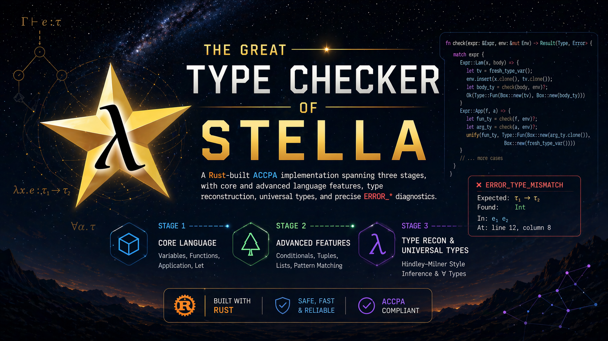

# ACCPA Stella Type Checker (Rust)



This repository contains a Rust implementation of a type checker for the Stella language.
It was developed incrementally across multiple ACCPA stages, and the current codebase includes:

- Stage 1: core typing rules and core language constructs
- Stage 2: effects/features such as exceptions, references, subtyping, panic, and type cast
- Stage 3: type reconstruction and universal (polymorphic) types

The compiled binary is named `typechecker`.

## Table of Contents

- [Project Overview](#project-overview)
- [What Was Implemented by Stage](#what-was-implemented-by-stage)
- [Feature and Error Coverage Summary](#feature-and-error-coverage-summary)
- [Build and Run](#build-and-run)
- [Examples](#examples)
- [Running Tests](#running-tests)
- [Implementation Notes](#implementation-notes)

## Project Overview

The checker pipeline is:

1. Parse Stella source from stdin or from a file path argument.
2. Build an internal AST.
3. Type-check declarations and expressions.
4. Exit with code `0` on success, `1` on type errors or parse errors.

Important source files:

- `src/main.rs`: CLI entry point, input handling, parser invocation, process exit code
- `src/build.rs`: parse-tree to AST construction
- `src/ast.rs`: language AST (types, expressions, declarations, patterns)
- `src/typecheck.rs`: type checker logic, extension handling, reconstruction, subtyping
- `src/error.rs`: typed error enum and formatted `ERROR_*` messages
- `src/stellaLexer.g4`, `src/stellaParser.g4`: grammar inputs used by generated parser code

## What Was Implemented by Stage

### Stage 1 (Core Type Checker)

Implemented foundation:

- Main function validation:
  - `main` must exist
  - `main` must be a function
  - `main` must have exactly one parameter
- Core expressions and types:
  - `Nat`, `Bool`, `Unit`
  - function abstraction and application
  - arithmetic and boolean operations
  - conditionals
  - tuples, records, variants, lists
  - pattern matching (including exhaustiveness checks)
  - recursive constructions like `Nat::rec`, `fix`, fold/unfold forms present in AST/type checker
- Core type errors (examples):
  - `ERROR_UNDEFINED_VARIABLE`
  - `ERROR_NOT_A_FUNCTION`
  - `ERROR_UNEXPECTED_TYPE_FOR_EXPRESSION`
  - `ERROR_NONEXHAUSTIVE_MATCH_PATTERNS`

### Stage 2 (Advanced Features)

Extended checker with:

- Exceptions:
  - exception type declarations
  - throw/try-catch/try-with typing
  - open-variant exception declaration checks
- References and sequencing:
  - memory address, reference creation, dereference, assignment
  - sequencing behavior with `Unit`
- Subtyping and top/bottom interactions:
  - structural subtyping checks (records/functions/etc.)
  - `Top`/`Bottom` related checks when enabled by extensions
- Panic and cast typing:
  - `panic!` typing rules and ambiguity handling
  - type-cast rules with subtyping features
- Stage-2 style error families (examples):
  - `ERROR_EXCEPTION_TYPE_NOT_DECLARED`
  - `ERROR_NOT_A_REFERENCE`
  - `ERROR_AMBIGUOUS_PANIC_TYPE`
  - `ERROR_UNEXPECTED_SUBTYPE`

### Stage 3 (Type Reconstruction + Universal Types)

Implemented advanced inference/polymorphism support:

- Type reconstruction:
  - `Auto` types are rewritten into fresh meta variables
  - unification-based solving with substitution tracking
  - occurs-check protection against infinite types
  - ambiguity detection for unresolved type variables
- Universal types:
  - generic function declarations (`DeclGenericFun`)
  - type abstraction and type application support in checker/AST
  - type-argument count validation
  - undefined type-variable checks in scoped generic signatures
- Stage-3 style error families (examples):
  - `ERROR_OCCURS_CHECK_INFINITE_TYPE`
  - `ERROR_AMBIGUOUS_TYPE`
  - `ERROR_NOT_A_GENERIC_FUNCTION`
  - `ERROR_INCORRECT_NUMBER_OF_TYPE_ARGUMENTS`

## Feature and Error Coverage Summary

The checker reports rich `ERROR_*` tags, including (non-exhaustive):

- Core typing mismatches and shape errors (`NOT_A_FUNCTION`, `NOT_A_TUPLE`, `NOT_A_RECORD`, ...)
- Pattern/match correctness (`DUPLICATE_PATTERN_VARIABLE`, `NONEXHAUSTIVE_MATCH_PATTERNS`, ...)
- Collection and ADT ambiguities (`AMBIGUOUS_LIST_TYPE`, `AMBIGUOUS_VARIANT_TYPE`, ...)
- Exception/reference/panic/subtyping errors
- Reconstruction/polymorphism errors

Public tests under `public-tests/hw1`, `public-tests/hw2`, and `public-tests/hw3` validate these tags via `check.sh` scripts.

## Build and Run

### Build (PowerShell)

```powershell
cargo build --release
```

Generated executable:

`target\release\typechecker.exe`

### Run One Program via stdin (PowerShell)

```powershell
Get-Content .\tests\Stage 1\well-typed\higher-order-1.stella | .\target\release\typechecker.exe
```

For well-typed programs, output is empty and exit code is `0`.

### Run Using File Argument

`main.rs` also supports a file path argument:

```powershell
.\target\release\typechecker.exe .\tests\Stage 1\ill-typed\applying-non-function-1.stella
```

### Check Exit Code

```powershell
echo $LASTEXITCODE
```

- `0`: well-typed
- non-zero: parse/type error

## Examples

### Stage 1 Example (Well-Typed)

From `tests\Stage 1\well-typed\higher-order-1.stella`:

```stella
language core;
fn iszero(n : Nat) -> Bool {
    return Nat::rec(n, true, fn(i : Nat) {
        return fn(r : Bool) {
            return true;
        };
    });
}
fn f(g : fn(Bool) -> Nat) -> fn(Nat) -> Nat {
    return fn(n : Nat) {
        return g(if iszero(n) then false else true);
    };
}
fn main(n : Nat) -> Nat {
  return f(fn (x : Bool) { return if x then n else succ(n); })(0);
}
```

### Stage 1 Example (Ill-Typed)

From `tests\Stage 1\ill-typed\applying-non-function-1.stella`:

```stella
language core;
fn main(f : Nat) -> Nat {
  return f(f);
}
```

Expected family of error: `ERROR_NOT_A_FUNCTION`.

### Stage 2 Example (Exceptions)

From `tests\Stage 2\well-typed\exceptions_throw_and_catch.stella`:

```stella
language core;
extend with #exceptions, #exception-type-declaration;
exception type = Nat
fn fail(n : Nat) -> Bool {
  return throw(succ(0))
}
fn main(n : Nat) -> Bool {
  return try { fail(n) } catch { a => false }
}
```

### Stage 2 Example (Ambiguous Throw Type)

From `tests\Stage 2\ill-typed\error_ambiguous_throw_type_no_context.stella`:

```stella
language core;
extend with #exceptions, #exception-type-declaration, #pairs, #let-bindings;
exception type = Nat
fn main(n : Nat) -> Nat {
  return let p = { throw(n), n } in p.2
}
```

Expected family of error: `ERROR_AMBIGUOUS_THROW_TYPE`.

### Stage 3 Example (Reconstruction Ambiguity)

Representative style from `public-tests\hw3\extra-9.in`:

```stella
language core;

extend with #exceptions, #exception-type-declaration, #type-reconstruction;

exception type = auto

fn fail(n : auto) -> auto {
  return throw(succ(0))
}

fn main(n : auto) -> auto {
  return try {
    fail(n)
  } catch {
    a => true
  }
}
```

Expected family of error: `ERROR_AMBIGUOUS_TYPE`.

### Stage 3 Example (Shape Conflict During Reconstruction)

From `tmp_cases\issue5_shape_unify_conflict.stella`:

```stella
language core;
extend with #type-reconstruction;
fn bad(f : Auto) -> Nat {
  return f(0)
}
fn main(x : Nat) -> Nat {
  return bad(x)
}
```

Expected family of error: `ERROR_NOT_A_FUNCTION` (or another reconstruction-related mismatch depending on priority rules).

## Running Tests

### Run Stage 1 Local Tests (PowerShell)

```powershell
Get-ChildItem ".\tests\Stage 1\well-typed\*.stella" | ForEach-Object {
    Write-Host "`n[Stage 1 well] $($_.Name)"
    Get-Content $_.FullName | .\target\release\typechecker.exe
    Write-Host "Exit Code: $LASTEXITCODE"
}

Get-ChildItem ".\tests\Stage 1\ill-typed\*.stella" | ForEach-Object {
    Write-Host "`n[Stage 1 ill] $($_.Name)"
    Get-Content $_.FullName | .\target\release\typechecker.exe
    Write-Host "Exit Code: $LASTEXITCODE"
}
```

### Run Stage 2 Local Tests (PowerShell)

```powershell
Get-ChildItem ".\tests\Stage 2\well-typed\*.stella" | ForEach-Object {
    Write-Host "`n[Stage 2 well] $($_.Name)"
    Get-Content $_.FullName | .\target\release\typechecker.exe
    Write-Host "Exit Code: $LASTEXITCODE"
}

Get-ChildItem ".\tests\Stage 2\ill-typed\*.stella" | ForEach-Object {
    Write-Host "`n[Stage 2 ill] $($_.Name)"
    Get-Content $_.FullName | .\target\release\typechecker.exe
    Write-Host "Exit Code: $LASTEXITCODE"
}
```

### Run Public Test Sets (PowerShell-Friendly)

Public test folders:

- `public-tests\hw1`
- `public-tests\hw2`
- `public-tests\hw3`

Each folder provides `check.sh`, `.in`, `.out`, and `.out.full` files.

On Windows PowerShell, when piping into native commands and checking expected tags, one robust pattern is running the checker through `cmd.exe` redirection:

```powershell
$case = ".\public-tests\hw3\extra-9.in"
cmd.exe /c ".\target\release\typechecker.exe < $case"
```

You can then compare emitted `ERROR_*` tag(s) with corresponding `.out`/`.out.full` expected files.

## Implementation Notes

- Extension names are normalized by trimming leading `#` (for example, `#type-reconstruction` -> `type-reconstruction`).
- The checker tracks active extension flags in context and enables behaviors conditionally.
- In reconstruction mode, strict ambiguous-type checks are enabled and unresolved type variables can trigger `ERROR_AMBIGUOUS_TYPE`.
- There is a controlled fallback pass to improve error priority around `main` in reconstruction-heavy cases.

## Current Scope

This README reflects the current implementation in this repository and the available local/public test assets.
If you add new extensions or stages, update:

- stage feature lists
- example programs
- test-running commands and expected error tags
